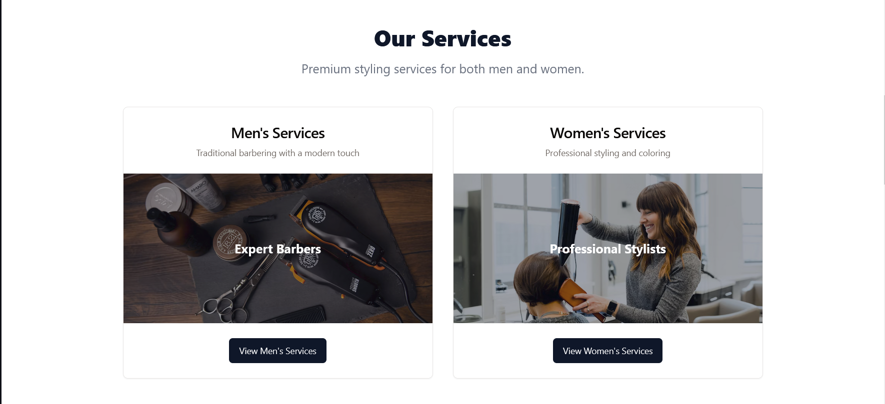
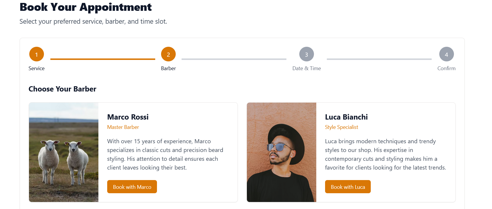

# Barbershop Booking System: Comprehensive Technical Guide

This document provides an in-depth explanation of the Barbershop Booking System application, covering both frontend and backend aspects. It's designed to help beginners understand how the entire system works, from basic concepts to advanced implementations.

## Screenshots

### 🏠 Home Page




*The elegant landing page showcasing our premium grooming services with hero section and service previews*

### 👨‍💼 Men's Services


*Comprehensive catalog of men's grooming services including haircuts, beard styling, and traditional barbering*

### 👩‍💼 Women's Services  

*Professional women's styling services including cuts, coloring, and blow-dry styling*

### 📅 Booking Interface




*User-friendly booking system allowing clients to select services, barbers, dates, and time slots*

### 👥 Meet Our Team


*Professional profiles of our skilled barbers with specialties and experience*

### 🔐 Authentication

*Secure login and registration system for clients and barbers*


### 📊 Barber Dashboard


*Comprehensive dashboard for barbers to manage appointments and view schedules with an interactive calendar interface for barbers to manage availability and block time slots*

## Table of Contents

1. [Introduction](#introduction)
2. [Technology Stack](#technology-stack)
3. [System Architecture](#system-architecture)
4. [Database Design](#database-design)
5. [Backend Implementation](#backend-implementation)
   - [Server Setup](#server-setup)
   - [API Routes](#api-routes)
   - [Authentication](#authentication)
   - [Data Storage](#data-storage)
6. [Frontend Implementation](#frontend-implementation)
   - [Component Structure](#component-structure)
   - [State Management](#state-management)
   - [Authentication Flow](#authentication-flow)
   - [Form Handling](#form-handling)
   - [Routing](#routing)
7. [Advanced Features](#advanced-features)
   - [Time Slot Management](#time-slot-management)
   - [Appointment Scheduling](#appointment-scheduling)
   - [Calendar Integration](#calendar-integration)
8. [Deployment Guidelines](#deployment-guidelines)
9. [Troubleshooting](#troubleshooting)
10. [Conclusion](#conclusion)

## Introduction

The Barbershop Booking System is a modern web application that allows clients to book appointments with barbers. It provides features for user authentication, service selection, appointment management, and time slot blocking for barbers.

Key features include:
- User registration and authentication
- Service browsing and selection
- Appointment booking with date and time selection
- Barber dashboard for appointment management
- Calendar view for barbers to manage their schedule
- Ability to block off time periods for personal use

## Technology Stack

This application uses a modern JavaScript/TypeScript stack:

### Frontend
- **React**: A JavaScript library for building user interfaces
- **TypeScript**: A strongly typed programming language that builds on JavaScript
- **TanStack Query** (formerly React Query): For server state management and data fetching
- **React Hook Form**: For form validation and submission
- **Tailwind CSS**: A utility-first CSS framework
- **Shadcn UI**: A collection of reusable components built with Radix UI and Tailwind CSS
- **Wouter**: A routing library for React applications

### Backend
- **Node.js**: A JavaScript runtime built on Chrome's V8 JavaScript engine
- **Express**: A minimal and flexible Node.js web application framework
- **Drizzle ORM**: A TypeScript ORM for SQL databases
- **PostgreSQL**: A powerful, open-source object-relational database system
- **JWT** (JSON Web Tokens): For secure authentication
- **Zod**: A TypeScript-first schema validation library

## System Architecture

The application follows a client-server architecture:

1. **Client** (Frontend): A React application that handles UI rendering and user interactions.
2. **Server** (Backend): A Node.js Express server that processes API requests and handles business logic.
3. **Database**: A PostgreSQL database that stores application data.

Communication between client and server happens via RESTful API calls. The client sends HTTP requests to the server, which processes them and returns responses with appropriate data.

```
┌────────────┐      HTTP      ┌────────────┐      SQL      ┌────────────┐
│            │  Requests/     │            │  Queries/     │            │
│  Frontend  │ ─────────────> │  Backend   │ ─────────────>│  Database  │
│  (React)   │  Responses     │  (Express) │  Results      │ (PostgreSQL)│
│            │ <───────────── │            │ <───────────── │            │
└────────────┘                └────────────┘                └────────────┘
```

## Database Design

The application uses a relational database model with several tables defined in `shared/schema.ts`:

```typescript
// From shared/schema.ts
export const userRoleEnum = pgEnum('user_role', ['client', 'barber', 'admin']);
export const serviceTypeEnum = pgEnum('service_type', ['haircut', 'beard', 'combo', 'womens-haircut', 'womens-styling', 'womens-color']);
export const appointmentStatusEnum = pgEnum('appointment_status', ['pending', 'confirmed', 'cancelled', 'completed']);

export const users = pgTable("users", {
  id: serial("id").primaryKey(),
  username: text("username").notNull().unique(),
  email: text("email").notNull().unique(),
  password: text("password").notNull(),
  fullName: text("full_name"),
  phone: text("phone"),
  role: userRoleEnum("role").default("client").notNull(),
  createdAt: timestamp("created_at").defaultNow().notNull(),
});

export const services = pgTable("services", {
  id: serial("id").primaryKey(),
  name: text("name").notNull(),
  description: text("description"),
  price: numeric("price", { precision: 10, scale: 2 }).notNull(),
  duration: integer("duration").notNull(),
  type: serviceTypeEnum("type").default("haircut").notNull(),
  image: text("image"),
});

export const barbers = pgTable("barbers", {
  id: serial("id").primaryKey(),
  userId: integer("user_id").references(() => users.id),
  speciality: text("speciality"),
  image: text("image"),
  bio: text("bio"),
});

export const appointments = pgTable("appointments", {
  id: serial("id").primaryKey(),
  userId: integer("user_id").references(() => users.id).notNull(),
  barberId: integer("barber_id").references(() => barbers.id).notNull(),
  serviceId: integer("service_id").references(() => services.id).notNull(),
  date: timestamp("date").notNull(),
  status: appointmentStatusEnum("status").default("pending").notNull(),
  notes: text("notes"),
  createdAt: timestamp("created_at").defaultNow().notNull(),
});

export const timeSlots = pgTable("time_slots", {
  id: serial("id").primaryKey(),
  barberId: integer("barber_id").references(() => barbers.id).notNull(),
  startTime: timestamp("start_time").notNull(),
  endTime: timestamp("end_time").notNull(),
  isBooked: boolean("is_booked").default(false).notNull(),
});
```

The schema defines relationships between tables using Drizzle ORM's relations:

```typescript
// Relations are defined at the bottom of shared/schema.ts
export const usersRelations = relations(users, ({ many, one }) => ({
  barber: one(barbers, { fields: [users.id], references: [barbers.userId] }),
  appointments: many(appointments),
}));

export const barbersRelations = relations(barbers, ({ one, many }) => ({
  user: one(users, { fields: [barbers.userId], references: [users.id] }),
  appointments: many(appointments),
  timeSlots: many(timeSlots),
}));

export const servicesRelations = relations(services, ({ many }) => ({
  appointments: many(appointments),
}));

export const appointmentsRelations = relations(appointments, ({ one }) => ({
  user: one(users, { fields: [appointments.userId], references: [users.id] }),
  barber: one(barbers, { fields: [appointments.barberId], references: [barbers.id] }),
  service: one(services, { fields: [appointments.serviceId], references: [services.id] }),
}));

export const timeSlotsRelations = relations(timeSlots, ({ one }) => ({
  barber: one(barbers, { fields: [timeSlots.barberId], references: [barbers.id] }),
}));
```

## Backend Implementation

### Server Setup

The server is set up using Express in `server/index.ts`:

```typescript
// From server/index.ts
import express, { Request, Response, NextFunction } from "express";
import cors from "cors";
import dotenv from "dotenv";
import { log, setupVite, serveStatic } from "./vite";
import { registerRoutes } from "./routes";
import { initializeDatabase } from "./db";

async function main() {
  dotenv.config();
  
  // Initialize database
  log("Initializing database connection...");
  await initializeDatabase();
  log("Database initialized successfully");
  
  // Create Express app
  const app = express();
  
  // Apply middleware
  app.use(cors());
  app.use(express.json());
  
  // Register API routes
  const server = await registerRoutes(app);
  
  // Handle errors
  app.use((err: any, _req: Request, res: Response, _next: NextFunction) => {
    console.error(err.stack);
    res.status(500).send("Something broke!");
  });
  
  // Set up Vite for development
  setupVite(app, server);
  
  // Start the server
  const port = process.env.PORT || 5000;
  server.listen(port, () => {
    log(`serving on port ${port}`);
  });
}

main();
```

### API Routes

API routes are defined in `server/routes.ts` and follow RESTful conventions:

```typescript
// From server/routes.ts (excerpt)
export async function registerRoutes(app: Express): Promise<Server> {
  // Set up API router
  const apiRouter = express.Router();
  app.use("/api", apiRouter);
  
  // Authentication
  apiRouter.post("/auth/register", async (req, res) => {
    // User registration logic
  });
  
  apiRouter.post("/auth/login", async (req, res) => {
    // User login logic
  });
  
  // Services
  apiRouter.get("/services", async (req, res) => {
    // Get services logic
  });
  
  // Barbers
  apiRouter.get("/barbers", async (req, res) => {
    // Get barbers logic
  });
  
  // Appointments
  apiRouter.get("/appointments", authenticate, async (req, res) => {
    // Get appointments logic
  });
  
  apiRouter.post("/appointments", authenticate, async (req, res) => {
    // Create appointment logic
  });
  
  // Time slots
  apiRouter.get("/time-slots", authenticate, async (req, res) => {
    // Get time slots logic
  });
  
  apiRouter.post("/time-slots", authenticate, async (req, res) => {
    // Create time slot logic
  });
  
  apiRouter.delete("/time-slots/:id", authenticate, async (req, res) => {
    // Delete time slot logic
  });
  
  // Create HTTP server
  const httpServer = createServer(app);
  return httpServer;
}
```

### Authentication

Authentication is implemented using JWT (JSON Web Tokens) and password encryption:

```typescript
// From server/routes.ts (auth section)
apiRouter.post("/auth/register", async (req, res) => {
  try {
    // Validate request body
    const result = registerSchema.safeParse(req.body);
    if (!result.success) {
      return res.status(400).json({ message: "Invalid registration data", errors: result.error });
    }
    
    // Check if user already exists
    const existingUser = await storage.getUserByEmail(req.body.email);
    if (existingUser) {
      return res.status(400).json({ message: "User with this email already exists" });
    }
    
    // Hash password
    const salt = await bcrypt.genSalt(10);
    const hashedPassword = await bcrypt.hash(req.body.password, salt);
    
    // Create user
    const user = await storage.createUser({
      ...req.body,
      password: hashedPassword
    });
    
    // Generate token
    const token = jwt.sign(
      { id: user.id, role: user.role },
      process.env.JWT_SECRET!,
      { expiresIn: '7d' }
    );
    
    // Remove password from response
    const { password, ...userWithoutPassword } = user;
    
    res.status(201).json({ user: userWithoutPassword, token });
  } catch (error) {
    console.error("Registration error:", error);
    res.status(500).json({ message: "Internal server error" });
  }
});
```

The `authenticate` middleware validates JWT tokens for protected routes:

```typescript
// From server/routes.ts
const authenticate = (req: Request, res: Response, next: Function) => {
  try {
    const token = req.headers.authorization?.split(" ")[1];
    
    if (!token) {
      return res.status(401).json({ message: "Authentication token is required" });
    }
    
    const decoded = jwt.verify(token, process.env.JWT_SECRET!) as { id: number, role: string };
    req.user = decoded;
    
    next();
  } catch (error) {
    return res.status(401).json({ message: "Invalid or expired token" });
  }
};
```

### Data Storage

The application uses Drizzle ORM to interact with the PostgreSQL database:

```typescript
// From server/db.ts
import { drizzle } from "drizzle-orm/node-postgres";
import { Pool } from "pg";
import * as schema from "@shared/schema";

// Create a PostgreSQL connection pool
export const pool = new Pool({
  connectionString: process.env.DATABASE_URL
});

// Create a Drizzle instance with the schema
export const db = drizzle(pool, { schema });

// Test the database connection
export async function testConnection() {
  try {
    const result = await pool.query("SELECT NOW()");
    console.log("Successfully connected to PostgreSQL database");
    return true;
  } catch (error) {
    console.error("Database connection error:", error);
    return false;
  }
}
```

The data storage layer implements the `IStorage` interface defined in `server/storage.ts`:

```typescript
// From server/storage.ts (interface)
export interface IStorage {
  // User operations
  getUser(id: number): Promise<User | undefined>;
  getUserByEmail(email: string): Promise<User | undefined>;
  getUserByUsername(username: string): Promise<User | undefined>;
  createUser(user: InsertUser): Promise<User>;
  updateUser(id: number, user: Partial<InsertUser>): Promise<User | undefined>;
  
  // Service operations
  getServices(): Promise<Service[]>;
  getService(id: number): Promise<Service | undefined>;
  createService(service: InsertService): Promise<Service>;
  
  // Barber operations
  getBarbers(): Promise<Barber[]>;
  getBarber(id: number): Promise<Barber | undefined>;
  getBarberByUserId(userId: number): Promise<Barber | undefined>;
  createBarber(barber: InsertBarber): Promise<Barber>;
  
  // Appointment operations
  getAppointments(): Promise<Appointment[]>;
  getAppointment(id: number): Promise<Appointment | undefined>;
  getAppointmentsByUser(userId: number): Promise<Appointment[]>;
  getAppointmentsByBarber(barberId: number): Promise<Appointment[]>;
  createAppointment(appointment: InsertAppointment): Promise<Appointment>;
  updateAppointment(id: number, appointment: Partial<InsertAppointment>): Promise<Appointment | undefined>;
  deleteAppointment(id: number): Promise<boolean>;
  
  // Time slot operations
  getTimeSlots(barberId: number, date: Date): Promise<TimeSlot[]>;
  getTimeSlot(id: number): Promise<TimeSlot | undefined>;
  createTimeSlot(timeSlot: InsertTimeSlot): Promise<TimeSlot>;
  updateTimeSlot(id: number, timeSlot: Partial<InsertTimeSlot>): Promise<TimeSlot | undefined>;
  deleteTimeSlot(id: number): Promise<boolean>;
}
```

The implementation with Drizzle ORM in `server/pgStorage.ts`:

```typescript
// From server/pgStorage.ts (example method)
async getTimeSlots(barberId: number, date: Date): Promise<TimeSlot[]> {
  const startOfDay = new Date(date);
  startOfDay.setHours(0, 0, 0, 0);
  
  const endOfDay = new Date(date);
  endOfDay.setHours(23, 59, 59, 999);
  
  // Use a single where condition with AND to filter by date range
  return await db
    .select()
    .from(timeSlots)
    .where(
      sql`${timeSlots.barberId} = ${barberId} AND 
          ${timeSlots.startTime} >= ${startOfDay} AND 
          ${timeSlots.startTime} <= ${endOfDay}`
    );
}
```

## Frontend Implementation

### Component Structure

The frontend is organized into components, pages, and hooks:

```
client/
├── src/
│   ├── components/
│   │   ├── ui/              # Shadcn UI components
│   │   ├── BarberCalendarView.tsx
│   │   ├── BarberCard.tsx
│   │   ├── BarberDashboard.tsx
│   │   ├── BookingForm.tsx
│   │   ├── EnhancedBarberDashboard.tsx
│   │   ├── Footer.tsx
│   │   ├── Navbar.tsx
│   │   ├── PendingAppointments.tsx
│   │   └── ServiceCard.tsx
│   ├── hooks/
│   │   ├── use-auth.tsx
│   │   ├── use-mobile.tsx
│   │   └── use-toast.ts
│   ├── lib/
│   │   ├── auth.tsx
│   │   ├── queryClient.ts
│   │   └── utils.ts
│   ├── pages/
│   │   ├── AboutUs.tsx
│   │   ├── Booking.tsx
│   │   ├── Dashboard.tsx
│   │   ├── Home.tsx
│   │   ├── Login.tsx
│   │   ├── MensServices.tsx
│   │   ├── Register.tsx
│   │   └── WomensServices.tsx
│   ├── App.tsx
│   ├── index.css
│   └── main.tsx
```

### State Management

The application uses TanStack Query for server state management:

```typescript
// From client/src/lib/queryClient.ts
import { QueryClient } from "@tanstack/react-query";

export async function apiRequest(
  method: string,
  path: string,
  body?: any
): Promise<Response> {
  const options: RequestInit = {
    method,
    headers: {
      "Content-Type": "application/json",
    },
  };

  // Add auth token if available
  const token = localStorage.getItem("token");
  if (token) {
    options.headers = {
      ...options.headers,
      Authorization: `Bearer ${token}`,
    };
  }

  // Add body for non-GET requests
  if (body && method !== "GET") {
    options.body = JSON.stringify(body);
  }

  const response = await fetch(path, options);
  
  // Handle errors
  if (!response.ok) {
    const errorData = await response.json().catch(() => ({}));
    throw new Error(errorData.message || "An error occurred");
  }
  
  return response;
}

// Create a query client with default options
export const queryClient = new QueryClient({
  defaultOptions: {
    queries: {
      staleTime: 1000 * 60 * 5, // 5 minutes
      retry: 1,
      refetchOnWindowFocus: false,
    },
  },
});
```

Example of a query in a component:

```typescript
// From client/src/components/EnhancedBarberDashboard.tsx
const timeSlotsQuery = useQuery({
  queryKey: [
    '/api/time-slots', 
    barberQuery.data?.id, 
    selectedDate.toISOString().split('T')[0]
  ],
  queryFn: async () => {
    if (!barberQuery.data?.id) return [];
    
    const res = await apiRequest(
      'GET', 
      `/api/time-slots?barberId=${barberQuery.data.id}&date=${encodeURIComponent(selectedDate.toISOString().split('T')[0])}` 
    );
    return res.json();
  },
  enabled: !!user && !!barberQuery.data?.id
});
```

### Authentication Flow

Authentication is managed through a context provider:

```typescript
// From client/src/lib/auth.tsx
export const AuthProvider = ({ children }: AuthProviderProps) => {
  const [user, setUser] = useState<User | null>(null);
  const [token, setToken] = useState<string | null>(localStorage.getItem('token'));
  const [isLoading, setIsLoading] = useState(true);
  const [error, setError] = useState<string | null>(null);
  
  // Check if user is already logged in
  useEffect(() => {
    const checkAuth = async () => {
      if (!token) {
        setIsLoading(false);
        return;
      }
      
      try {
        const res = await fetch('/api/auth/me', {
          headers: {
            Authorization: `Bearer ${token}`
          }
        });
        
        if (res.ok) {
          const userData = await res.json();
          setUser(userData);
        } else {
          // Clear invalid token
          localStorage.removeItem('token');
          setToken(null);
        }
      } catch (err) {
        console.error("Auth check error:", err);
      } finally {
        setIsLoading(false);
      }
    };
    
    checkAuth();
  }, [token]);
  
  const login = async (email: string, password: string) => {
    setError(null);
    try {
      const res = await fetch('/api/auth/login', {
        method: 'POST',
        headers: {
          'Content-Type': 'application/json'
        },
        body: JSON.stringify({ email, password })
      });
      
      if (!res.ok) {
        const errorData = await res.json();
        throw new Error(errorData.message || 'Login failed');
      }
      
      const data = await res.json();
      localStorage.setItem('token', data.token);
      setToken(data.token);
      setUser(data.user);
    } catch (err: any) {
      setError(err.message);
      throw err;
    }
  };
  
  const logout = () => {
    localStorage.removeItem('token');
    setToken(null);
    setUser(null);
  };
  
  // Rest of the code...
  
  return (
    <AuthContext.Provider
      value={{
        user,
        token,
        isLoading,
        error,
        login,
        register,
        logout
      }}
    >
      {children}
    </AuthContext.Provider>
  );
};
```

Using the auth context in components:

```typescript
// Example usage in a component
import { useAuth } from "@/lib/auth";

function MyComponent() {
  const { user, login, logout, isLoading } = useAuth();
  
  if (isLoading) {
    return <div>Loading...</div>;
  }
  
  if (!user) {
    return <div>Not logged in</div>;
  }
  
  return (
    <div>
      <p>Welcome, {user.fullName || user.username}!</p>
      <button onClick={logout}>Logout</button>
    </div>
  );
}
```

### Form Handling

Forms are handled using React Hook Form with Zod validation:

```typescript
// From client/src/pages/Login.tsx
import { useForm } from "react-hook-form";
import { zodResolver } from "@hookform/resolvers/zod";
import { loginSchema } from "@shared/schema";
import { useAuth } from "@/lib/auth";

function LoginPage() {
  const { login } = useAuth();
  
  const form = useForm({
    resolver: zodResolver(loginSchema),
    defaultValues: {
      email: "",
      password: ""
    }
  });
  
  const onSubmit = async (data) => {
    try {
      await login(data.email, data.password);
      // Redirect after successful login
    } catch (error) {
      // Handle error
    }
  };
  
  return (
    <form onSubmit={form.handleSubmit(onSubmit)}>
      <div>
        <label>Email</label>
        <input {...form.register("email")} />
        {form.formState.errors.email && (
          <p>{form.formState.errors.email.message}</p>
        )}
      </div>
      
      <div>
        <label>Password</label>
        <input type="password" {...form.register("password")} />
        {form.formState.errors.password && (
          <p>{form.formState.errors.password.message}</p>
        )}
      </div>
      
      <button type="submit" disabled={form.formState.isSubmitting}>
        {form.formState.isSubmitting ? "Logging in..." : "Login"}
      </button>
    </form>
  );
}
```

### Routing

Routing is handled using the Wouter library:

```typescript
// From client/src/App.tsx
import { Switch, Route } from "wouter";
import HomePage from "@/pages/Home";
import LoginPage from "@/pages/Login";
import RegisterPage from "@/pages/Register";
import DashboardPage from "@/pages/Dashboard";
import BookingPage from "@/pages/Booking";
import NotFound from "@/pages/not-found";
import { AuthProvider } from "@/lib/auth";
import { QueryClientProvider } from "@tanstack/react-query";
import { queryClient } from "@/lib/queryClient";

function Router() {
  return (
    <Switch>
      <Route path="/" component={HomePage} />
      <Route path="/login" component={LoginPage} />
      <Route path="/register" component={RegisterPage} />
      <Route path="/dashboard" component={DashboardPage} />
      <Route path="/booking" component={BookingPage} />
      <Route component={NotFound} />
    </Switch>
  );
}

function App() {
  return (
    <QueryClientProvider client={queryClient}>
      <AuthProvider>
        <main className="min-h-screen flex flex-col">
          <Router />
        </main>
      </AuthProvider>
    </QueryClientProvider>
  );
}

export default App;
```

## Advanced Features

### Time Slot Management

Barbers can block off time periods using the calendar view:

```typescript
// From client/src/components/BarberCalendarView.tsx
const blockTimeMutation = useMutation({
  mutationFn: async () => {
    if (!blockStartTime || !blockEndTime) {
      throw new Error("Start and end times are required");
    }
    
    // Call the onBlockTime function from props
    onBlockTime(blockStartTime, blockEndTime);
    return null;
  },
  onSuccess: () => {
    setBlockTimeDialogOpen(false);
    setBlockStartTime(null);
    setBlockEndTime(null);
    toast({
      title: "Time blocked",
      description: "The time slot has been successfully blocked",
    });
  },
  onError: (error: Error) => {
    toast({
      variant: "destructive",
      title: "Failed to block time",
      description: error.message || "An error occurred while blocking the time slot",
    });
  }
});

const handleBlockTimeSubmit = () => {
  blockTimeMutation.mutate();
};
```

The parent component handles the actual API call:

```typescript
// From client/src/components/EnhancedBarberDashboard.tsx
const blockTimeMutation = useMutation({
  mutationFn: async ({ startTime, endTime }: { startTime: Date, endTime: Date }) => {
    if (!user) throw new Error("User not authenticated");
    
    if (!barberQuery.data) throw new Error("Barber profile not found");
    
    // Create a new time slot
    const res = await apiRequest('POST', '/api/time-slots', {
      barberId: barberQuery.data.id,
      startTime: startTime.toISOString(),
      endTime: endTime.toISOString(),
      isBooked: true
    });
    
    return res.json();
  },
  onSuccess: () => {
    // Invalidate with the specific query keys to refresh the time slots
    queryClient.invalidateQueries({ 
      queryKey: [
        '/api/time-slots', 
        barberQuery.data?.id, 
        selectedDate.toISOString().split('T')[0]
      ] 
    });
    
    toast({
      title: "Success",
      description: "Time slot blocked successfully",
    });
  },
  onError: (error) => {
    toast({
      variant: "destructive",
      title: "Error",
      description: `Failed to block time slot: ${error.message}`,
    });
  }
});

const handleBlockTime = (startTime: Date, endTime: Date) => {
  blockTimeMutation.mutate({ startTime, endTime });
};
```

### Appointment Scheduling

Clients can book appointments using the booking form:

```typescript
// From client/src/components/BookingForm.tsx
const createAppointmentMutation = useMutation({
  mutationFn: async (appointmentData: any) => {
    const res = await apiRequest('POST', '/api/appointments', appointmentData);
    return res.json();
  },
  onSuccess: () => {
    toast({
      title: "Appointment booked",
      description: "Your appointment has been successfully booked",
    });
    
    // Reset form
    setSelectedService(null);
    setSelectedBarber(null);
    setSelectedDate(new Date());
    setSelectedTimeSlot(null);
    
    // Invalidate appointments query
    queryClient.invalidateQueries({ queryKey: ['/api/appointments'] });
  },
  onError: (error: Error) => {
    toast({
      variant: "destructive",
      title: "Failed to book appointment",
      description: error.message || "An error occurred while booking your appointment",
    });
  }
});

const handleBooking = () => {
  if (!user || !selectedService || !selectedBarber || !selectedTimeSlot) {
    toast({
      variant: "destructive",
      title: "Incomplete information",
      description: "Please select a service, barber, date, and time",
    });
    return;
  }
  
  createAppointmentMutation.mutate({
    userId: user.id,
    barberId: selectedBarber.id,
    serviceId: selectedService.id,
    date: selectedTimeSlot.startTime,
    notes: notes
  });
};
```

### Calendar Integration

The calendar view allows barbers to visualize their schedule:

```typescript
// From client/src/components/BarberCalendarView.tsx
return (
  <div className="grid md:grid-cols-[300px_1fr] gap-6">
    {/* Left side - Calendar picker */}
    <div>
      <Card>
        <CardHeader>
          <CardTitle>Select Date</CardTitle>
        </CardHeader>
        <CardContent>
          <Calendar
            mode="single"
            selected={selectedDate}
            onSelect={(date) => date && onDateChange(date)}
            className="rounded-md border"
            disabled={(date) => date < new Date()}
          />
          <div className="mt-4 text-sm text-gray-500">
            <div className="flex items-center gap-2 mb-1">
              <div className="w-3 h-3 rounded-full bg-green-500"></div>
              <span>Available</span>
            </div>
            <div className="flex items-center gap-2 mb-1">
              <div className="w-3 h-3 rounded-full bg-amber-500"></div>
              <span>Partially Booked</span>
            </div>
            <div className="flex items-center gap-2">
              <div className="w-3 h-3 rounded-full bg-red-500"></div>
              <span>Fully Booked</span>
            </div>
          </div>
        </CardContent>
      </Card>
    </div>

    {/* Right side - Time slots */}
    <Card>
      <CardHeader>
        <div className="flex justify-between items-center">
          <CardTitle>
            {isToday(selectedDate) ? "Today" : formatDate(selectedDate)}
          </CardTitle>
          <Dialog open={blockTimeDialogOpen} onOpenChange={setBlockTimeDialogOpen}>
            <DialogTrigger asChild>
              <Button size="sm">Block Off Time</Button>
            </DialogTrigger>
            <DialogContent>
              {/* Block time dialog content */}
            </DialogContent>
          </Dialog>
        </div>
      </CardHeader>
      <CardContent>
        {isLoading || timeSlotsLoading ? (
          <div className="space-y-2">
            {Array.from({ length: 8 }).map((_, i) => (
              <Skeleton key={i} className="h-14 w-full" />
            ))}
          </div>
        ) : timeSlotRows.length === 0 ? (
          <div className="text-center py-8 text-gray-500">
            No available time slots for this day.
          </div>
        ) : (
          <div className="space-y-2">
            {timeSlotRows.map((slot, i) => (
              <div
                key={i}
                className={cn(
                  "flex items-center p-3 rounded-md border",
                  slot.isBooked ? "bg-blue-50 border-blue-200" : 
                  slot.isBlocked ? "bg-gray-100 border-gray-200" : "bg-green-50 border-green-200 hover:border-green-300"
                )}
              >
                {/* Time slot content */}
              </div>
            ))}
          </div>
        )}
      </CardContent>
    </Card>
  </div>
);
```

## Deployment Guidelines

To deploy this application:

1. **Database Setup**:
   - Ensure PostgreSQL is installed and running
   - Create a database for the application
   - Set the `DATABASE_URL` environment variable

2. **Environment Variables**:
   - `DATABASE_URL`: PostgreSQL connection string
   - `JWT_SECRET`: Secret key for JWT authentication
   - `PORT`: Port for the server (default: 5000)

3. **Build Process**:
   - Install dependencies: `npm install`
   - Build the frontend: `npm run build`
   - Start the server: `npm start`

4. **Production Considerations**:
   - Use a process manager like PM2 to keep the application running
   - Set up HTTPS using a reverse proxy like Nginx
   - Configure database backups

## Troubleshooting

### Common Issues and Solutions

1. **Authentication Issues**:
   - Check that JWT_SECRET is set correctly
   - Verify that tokens are being sent with requests
   - Check token expiration time

2. **Database Connection Issues**:
   - Verify DATABASE_URL is correct
   - Check database server is running
   - Ensure database user has appropriate permissions

3. **API Errors**:
   - Check server logs for detailed error messages
   - Verify API endpoints match client expectations
   - Check request and response formats

4. **Time Slot Deletion Issues**:
   - Ensure query key invalidation is specific to the correct date and barber
   - Check that deleteTimeSlot function is working correctly
   - Verify the API is filtering appointments correctly

## Conclusion

This Barbershop Booking System demonstrates a modern approach to web application development using React, Node.js, and PostgreSQL. It showcases several important concepts:

1. **Full-Stack JavaScript**: Using JavaScript/TypeScript throughout the stack
2. **Type Safety**: Using TypeScript and Zod for validation
3. **Relational Database Design**: Structured data with Drizzle ORM
4. **Authentication & Authorization**: Secure user access with JWT
5. **Component-Based UI**: Modular, reusable components with React
6. **Server State Management**: Efficient data fetching with TanStack Query
7. **REST API Design**: Clear, consistent API endpoints

By studying this application, you'll gain a comprehensive understanding of modern web development practices and patterns that can be applied to a wide range of projects.